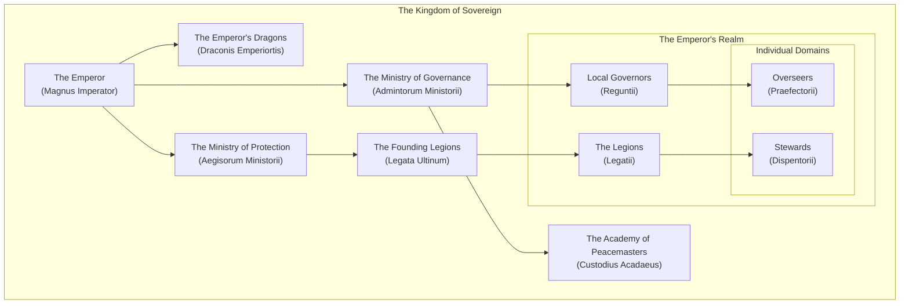

_"Our faith resilient, the line holds"_

## Prose

The Emperor's Realm, known in Sovarii as "Reyal Emportis," is composed of the dominions and protectorates ruled or administered by the Kingdom of Sovereign. It began with the aggressive expansion of Sovereign's borders that quickly encompassed the continent of Ha'ven. The controversial methods in which it was formed includes the hostile takeover of land as well as political manipulation of local powers. Under the order and supervision of the Sanguine King, the founder and current ruler of Sovereign, any opposition found to be in the way of the expansion was swiftly dashed by the supreme manpower and devotion of his Legions. Shortly after conquering Ha'ven, the King claimed himself the title of Emperor and formed the Ministry of Administration, also known in Sovarii as "Admintorum Ministorii."

## Organisation Structure

## Meta

| Name                        | Value                       |
| --------------------------- | --------------------------- |
| **Founding Date**           | 18th Day, 1st Month, 32 PrC |
| **Type**                    | Geopolitical, Empire        |
| **Capital**                 | Sovereign                   |
| **Alternative Names**       | Reyal Emportis              |
| **Training Level**          | Professional                |
| **Veterancy Level**         | Veteran                     |
| **Demonym**                 | Reyallian                   |
| **Leader**                  | The Sanguine Emperor        |
| **Leader Title**            | Emperor                     |
| **Head of State**           | The Sanguine Emperor        |
| **Government System**       | Monarchy, Absolute          |
| **Power Structure**         | Feudal state                |
| **Economic System**         | Traditional                 |
| **Official State Religion** | Sanguinalum                 |
| **Parent Organization**     | The Kingdom of Sovereign    |
| **Deities**                 | The Sanguine Emperor        |
| **Location**                | Sovereign                   |
| **Official Languages**      | Sovarii                     |
