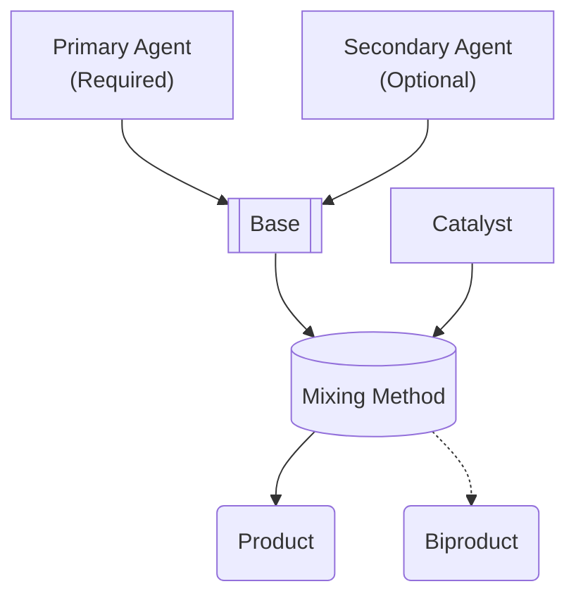

# ⚗️ Alchemy

The topic of Alchemy is barely touched upon in D&D, relegated to a simple check and some time. Let's make it more interesting! 🤓

Althrough not nescessarily required, as all classes can _technically_ do alchemy, being an Alchemist (a subclass of Artificer) really does help.

## Alchemist Benefits

- All checks are done with advantage.
- Process is done in half the time.
- Level 10 Alchemists double their output.

## Potions & Poisons

To create either a potion or poison requires the following components:

- **Base:** Delivery method and detectability.
- **Agent(s):** Up to two can be used, each providing an effect.
  - If two of the same agent are used, they may have an additional effect! See the ingredients table below for "concentrated" effects.
- **Catalyst:** Save DC and metabolization period.

The mixing method that you choose to create the potion with affects the efficiency (how much is produced) and potency (how much healing/damage it does) of the product.

### Creation

#### Mixing Methods

All mixing methods require the use of <a href="https://www.dndbeyond.com/equipment/alchemists-supplies" target="_blank">🐉 Alchemist's Supplies</a>, in addition to any requirements listed below.

|       Name       |                       Requirements                        | Efficiency | Potency |                        Dangers                         |
| :--------------: | :-------------------------------------------------------: | :--------: | :-----: | :----------------------------------------------------: |
|     Boiling      |                           None                            |    x0.5    |  x0.5   |                          None                          |
|     Blending     |                  Dexterity check (DC 10)                  |    x0.5    |   x1    |                          None                          |
|  Emulsification  |                Intelligence check (DC 10)                 |     x1     |  x0.5   |                          None                          |
| Pressure Boiling |               Advanced Alchemist's Supplies               |     x1     |   x1    |                          None                          |
|    Titration     |  Advanced Alchemist's Supplies, Dexterity check (DC 15)   |     x2     |   x1    | Destroy Advanced Alchemist's Supplies on critical fail |
|   Electrolysis   | Advanced Alchemist's Supplies, Intelligence check (DC 15) |     x1     |   x2    |        10d10 lightning damage on critical fail         |

#### Ingredients

##### Bases

|       Name        | Delivery Method |    Detectability    |
| :---------------: | :-------------: | :-----------------: |
|    🐝 Beeswax     |   Transdermal   | DC 5 Medical check  |
| 🩸 Monster Blood  |    Injection    | DC 10 Medical check |
| 💧 Purified Water |    Ingestion    | DC 15 Medical check |
|   🧂 Fine Salt    |   Inhalation    | DC 20 Medical check |
|   💨 Fairy Dust   |   Inhalation    | DC 25 Medical check |
|  💦 Troll Sweat   |    Ingestion    | DC 30 Medical check |

##### Agents

|   Name    |     Effect      |  Concentrated   |
| :-------: | :-------------: | :-------------: |
|   Rose    |   1d6 Healing   |        -        |
| Wormwood  |   2d8 Healing   | 10 temporary HP |
| Blaysting | 1d8 Fire Damage | 2d8 Fire Damage |

##### Catalysts

|    Name     | Save DC | Metabolization Period |
| :---------: | :-----: | :-------------------: |
| Citric Acid |   10    |       6 seconds       |

#### Biproducts

Roll a d100 and use this table to decide the biproduct of your alchemy:

|  D100  |                      Biproduct                       |
| :----: | :--------------------------------------------------: |
|  1-10  | Toxic gas that deals 5d10 poison in a 20 foot radius |
| 11-89  |                       Nothing                        |
| 90-100 |                 1x vial of Pure Viss                 |
