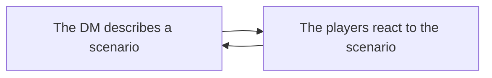
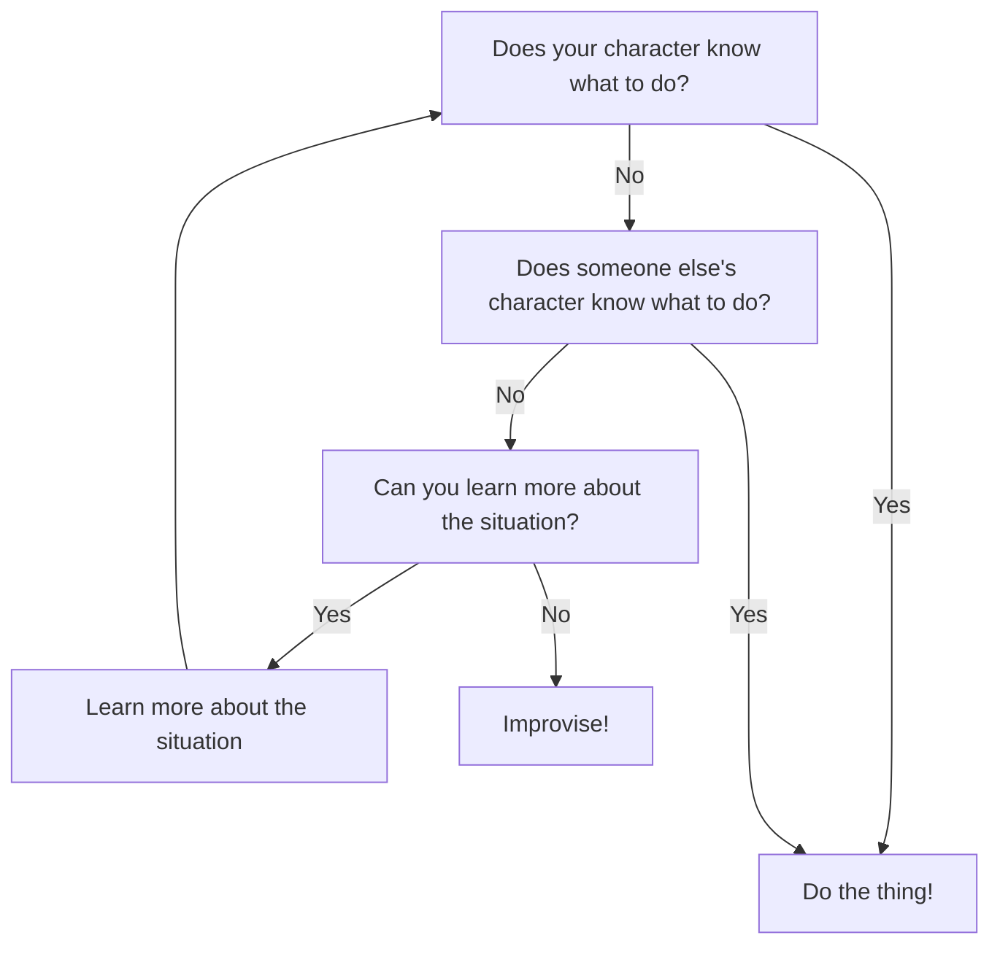

# PP: The Gameplay Loop

You can break down all D&D sessions into a basic repeating process:

These steps differ in specifics depending on whether the party is currently roleplaying, in combat, or in an action sequence.

## Roleplay

This scenario is the most common type and is yet the hardest to perfect in my experience. Players are expected to take charge and know their goals before reacting to potentially multiple NPCs in infinitely nuanced ways. To help players with this process, I recommend you learn the following steps for when you approach a situation:

This flowchart shouldn't be taken as law, but by loosely following it (especially if RP is slow) you can maintain momentum and continue to open up possibilities for the party. Keep in mind that improvisation isn't the same as doing something random! Instead, try pushing the party in the least dangerous direction to try and open up more opportunities for gathering information and (hopefully) doing the right thing.

## Gameplay

### Combat

The golden rules of combat are:

1. **Communicate** with your party!
2. Know what you're going to do **before your turn**.
3. Don't be afraid to **get creative**.
4. Remember that **running away** is always an option.

If you follow these rules, you'll have a much more enjoyable time in combat and so will the rest of the party.

### Action Sequence

Also known as a "skill challenge," an action sequence is a progression of actions that require ability checks to build up to an end goal of some sort. A good example of an action sequence is chasing a pickpocket, which could include actions such as:

1. **Investigation:** Identifying the pickpocket.
2. **Acrobatics:** Avoiding obstacles as you run after the pickpocket.
3. **Perception:** Finding a shortcut.
4. **Athletics:** Climing over a wall.
5. **Strength:** Tackling the pickpocket.

Due to the nature of action sequences, you will end up rolling a lot of checks in a short amount of time. To ensure this happens smoothely, make sure you roll the right check and not saving throws unless specified!

### Puzzles

Coming soon...
